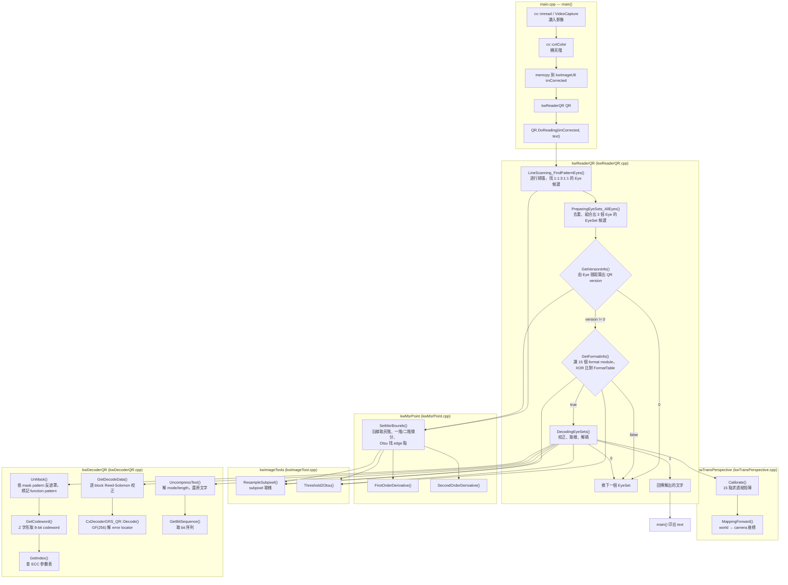

# QR Reader (C++)

A pure C++ QR code reader & decoder. Builds with CMake + OpenCV — no Qt/qmake required. Detects the finder patterns (eyes) by line scanning, performs a perspective correction, and decodes the payload with Reed–Solomon error correction.

## Features

- Line-scan finder detection with `1:1:3:1:1` ratio verification (subpixel, derivative-based edge finding)
- 3-eye set combination + geometric validation
- Version & format info extraction (XOR match against the format table)
- 15-point perspective calibration → deskewed sampling
- Local Otsu binarization per module
- Unmasking, codeword extraction (Z-path), Reed–Solomon correction over GF(256)
- CLI: two input modes — image file (default) or live camera (`-c / -d <idx>`)

## Project Structure

```
QR_project/
├── CMakeLists.txt        # CMake build (OpenCV auto-detect); static lib qr_lib + exe qr
├── src/
│   ├── main.cpp          # CLI entry: image file (default) or live camera → gray → kwReaderQR::DoReading
│   └── qr/               # Core reader + decoder sources
├── test_images/          # Sample QR images (QR/, perspective/, edge/)
└── result_images/        # Debug output images
```

## Requirements

- CMake ≥ 3.10
- A C++11 compiler (Apple Clang on macOS, GCC/Clang on Linux)
- OpenCV (any recent 3.x/4.x)

<details>
<summary>Install OpenCV (macOS)</summary>

```bash
brew install opencv
```

</details>

## Build

All commands run from this repository root (the folder containing `CMakeLists.txt`):

```bash
cmake -S . -B build
cmake --build build -j"$(sysctl -n hw.ncpu)"    # macOS; -j$(nproc) on Linux
```

**Troubleshooting — CMake can't find OpenCV:** point `OpenCV_DIR` at the OpenCV cmake folder and re-run configure.

```bash
export OpenCV_DIR=$(brew --prefix opencv)/lib/cmake/opencv4   # Homebrew macOS
cmake -S . -B build
```

## Usage

Two input modes: **image file** (default) and **live camera**.

```bash
# Decode a specific image
./build/qr test_images/QR/V5.png

# Live camera (device 0), with preview window — press 'q' or ESC to quit
./build/qr -c

# A different camera device, no preview window (Ctrl-C to quit)
./build/qr -d 1 -n
```

| Option | Meaning |
|---|---|
| `image` | Positional argument: image file to decode (default: `test_images/QR/V5_H.png`) |
| `-c`, `--camera` | Camera mode, default device (0) |
| `-d`, `--device <idx>` | Camera device index; implies `-c` |
| `-n`, `--no-window` | Camera mode without the preview window |
| `-h`, `--help` | Show usage |

Camera mode decodes every frame and prints each newly detected code:

```
Camera mode (device 0). Scanning... press 'q' or ESC to quit.
DECODED: Hello World
```

## Decoding Pipeline

Function call flow, starting from `main()` in `main.cpp`:



### 各階段說明

| 階段 | 主要 function | 說明 |
|---|---|---|
| 1. 讀圖 | `main()` | 讀入灰階圖並複製到 `kwImageU8` |
| 2. 找 Eye | `DoReading()` → `LineScanning_FindPatternEyes()` | 每 2 行掃描一次，用 `kwMsrPoint::SetMsrBounds()` 找 edge，再驗證 1:1:3:1:1 比例 |
| 3. 組 EyeSet | `PreparingEyeSets_AllEyes()` | 把重複的 Eye 合併，再從所有 Eye 中挑出符合幾何條件的 3 個 Eye 組合 |
| 4. 判 version | `GetVersionInfo()` | 量 Eye0→Eye1、Eye0→Eye2 的 module 數，算出 QR version |
| 5. 判 format | `GetFormatInfo()` | 取 15 個 format module 的灰階，Otsu 二值化後與 `FormatTable` 做 XOR 比對，得到 ECC level 與 mask pattern |
| 6. 校正取樣 | `DecodingEyeSets()` → `kwTransPerspective::Calibrate()` / `MappingForward()` | 用 15 個已知點求透視矩陣，把 QR 區域校正成直視圖 |
| 7. 二值化 | `DecodingEyeSets()` + `kwImageTools::Threshold2Otsu()` | 對校正後的 QR 做 local Otsu，得到黑白 module |
| 8. 反遮罩 | `kwDecoderQR::UnMask()` | 依 mask pattern 還原 data module，並標記 function pattern |
| 9. 取 codeword | `kwDecoderQR::GetCodeword()` | 沿 Z 字形路徑讀出 8-bit codeword |
| 10. RS 校正 | `kwDecoderQR::GetDecodeData()` → `CxDecoderGRS_QR::Decode()` | 用 Reed-Solomon 在 GF(256) 上校正每個 block |
| 11. 還原文字 | `kwDecoderQR::UncompressText()` → `GetBitSequence()` | 解 mode indicator、character count，還原成文字 |

## Notes on Decoding Accuracy

- Clean / synthetic QR images (e.g. `test_images/QR/V3.png`, `V5.png`) decode reliably.
- Distorted or real-world photos (e.g. `real*.jpg`) may find the eyes but fail Reed–Solomon correction due to perspective / calibration precision — a known limitation, not a build issue.

## License

Distributed under the [MIT License](LICENSE).
